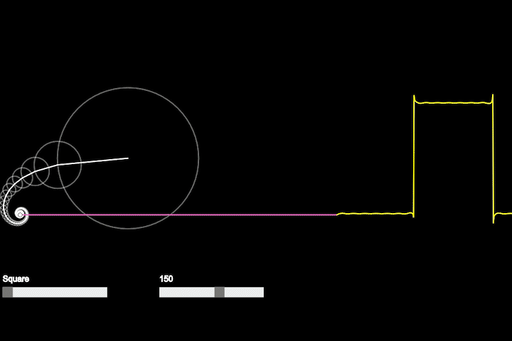

# Fourier Visualization

## Summary
My attempt at the Coding Trains Coding Challenge #125, which you can [watch here](https://www.youtube.com/watch?v=Mm2eYfj0SgA). It is a visualization of the [fourier series](https://en.wikipedia.org/wiki/Fourier_series). Coding Train explained it far better than I could, so if you are curious, check out his video. I expanded his model by adding saw tooth and triangle waves to the mix. 

## How it works
- A sin wave can be thought as plotting the position of a point around a circle as it rotates vs time.
- We can sum sine waves to approximate some functions, such as [square waves](https://en.wikipedia.org/wiki/Square_wave), which can be very handy.
- For more details, you should check out the Coding Train video or [this explaination](https://bilimneguzellan.net/en/purrier-series-meow-and-making-images-speak/).

## How to Install
- Just clone or download the files. You can use variety of ways to host the website locally.
- I use live server from VS Code.

## How to play
- There are two sliders you can control.
- One of which control which wave to approximate (square, saw tooth, or triangle)
- Other one changes the number of sine waves to sum. More waves means better approximation.
